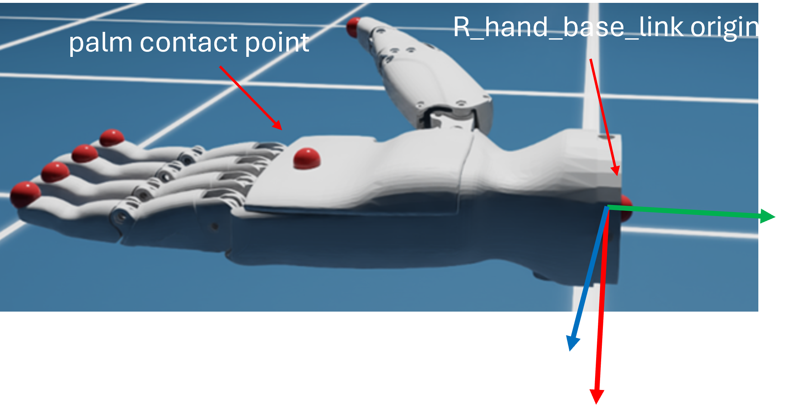

# Trajectory Recording

## To enable trajectory recording

in cfg/config.yaml:

```yaml
recording_dir: '/mnt/zl_dev/Render_1011' # change to your custom video saving path
trajectory_dir: '/mnt/zl_dev/traj_1011' # change to your custom trajectory saving path
enable_trajectory_recording: True # Set False to disable trajectory recording
```

**Note**: Currently there is a 200 frames interval between each video recording, which means in every two trajectories, only the first trajectory has recorded video. For example, trajectory *step-0.npy* and *step-400.npy* have corresponding recorded video *rl-video-step-0.mp4* and *rl-video-step-400.mp4*, but *step-200.npy* and *step-600.npy* don't have.

## Trained weights

/home/wenbo/Documents/repos/Luca_OmniIsaacGymEnvs/omniisaacgymenvs/runs/HorizontalGrasp/nn/HorizontalGrasp.pth

## Notation

### hand_dof_name 

['move_x', 'move_y', 'move_z', 'rot_r', 'rot_p', 'rot_y', 'R_index_proximal_joint', 'R_middle_proximal_joint', 'R_pinky_proximal_joint', 'R_ring_proximal_joint', 'R_thumb_proximal_yaw_joint', 'R_index_intermediate_joint', 'R_middle_intermediate_joint', 'R_pinky_intermediate_joint', 'R_ring_intermediate_joint', 'R_thumb_proximal_pitch_joint', 'R_thumb_intermediate_joint', 'R_thumb_distal_joint']

### joint_indices

Actuated dof
```python
[0, 1, 2, 3, 4, 5, 6, 7, 8, 9, 10, 15]
'move_x': 0
'move_y': 1
'move_z': 2
'rot_r': 3
'rot_p': 4
'rot_y': 5
'R_index_proximal_joint': 6
'R_middle_proximal_joint': 7
'R_pinky_proximal_joint': 8
'R_ring_proximal_joint': 9
'R_thumb_proximal_yaw_joint':10
'R_thumb_proximal_pitch_joint': 15
```
### hand contact points



## Recorded Trajectory Info

### hand_dof_pos_buf 
Joint states of all 18 dof, shape: [200, 1, 18], where 200 is trajectory length and 1 is num of environments.

**Note**: first 6 dof are base xyz and rpy, controlling the pose of hand in **its own** coordinate system, which is posed in environment coordinate system by **hand_start_translation** and **hand_start_orientation**. For example:
```python
self.hand_start_translation = torch.tensor([0.01, 0.01, 0.2], device=self.device)
self.hand_start_orientation = torch.tensor([1., 0., 0., 0.], device=self.device)
```
This set origin of hand coordinate system to [0.01, 0.0.1, 0.2] in env coordinate system, and XYZ axes are aligned. Therefore if base xyz joints are [0.1, -0.1, -0.13], the actual position of **R_hand_base_link** is at [0.11, -0.09, 0.07].


### hand_dof_velocities_buf 
Joint velocities of all 18 dof, shape: [200, 1, 18].

### action_buf 
Model prediction, clamped to [-1, 1], currently used for relative control for all joints, may further multiplied by scaling and smoothing factor to get target joint position, shape: [200, 1, 12].

### cur_targets_buf 
Actual target position sent to simulator, shape: [200, 1, 18].

Only send control target to actuated joints via selecting joint_indices:
```python
self._hands.set_joint_position_targets(self.cur_targets[:, joint_indices],joint_indices = joint_indices)
```

### right_hand_base_pose_buf 
position and orientation of **R_hand_base_link** in each environment's coordiantes. Position: xyz, orientation: quaternion(wxyz), concat to 7d vector, shape: [200, 1, 7].

### right_hand_palm_pose_buf 
position and orientation of **palm contact point** in each environment's coordiantes, which only has position shift from **R_hand_base_link**. Position: xyz, orientation: quaternion(wxyz), concat to 7d vector, shape: [200, 1, 7].

### hold_flag_buf 
Flag indicating whether hand is holding target object, shape: [200, 1].

```python
hold_flag = (right_hand_finger_dist <= max_finger_dist).int() + (right_hand_dist <= max_hand_dist).int()
```

right_hand_finger_dist: sum of five fingertip contact points to object point cloud distance.

right_hand_dist: palm contact points to object point cloud distance.

**Note**: max_finger_dist and max_hand_dist are copied from shadowhand pipeline without further change, thus **hold_flag == True** doesn't guarantee a firm grasp.

### lowest_buf 
lowest point of object point cloud, indicating whether object is still on the ground, shape: [200, 1].

**Note**: Usually value is around 0.002 when it is on the ground. In training, if this value > 0.01, object is considered lifted by hand.

### goal_reach_buf 
Indicating whether object to goal distance is within a threshold, shape: [200, 1].

```python
goal_dist = torch.norm(goal_pos - object_pos, p=2, dim=-1)
goal_reach = goal_dist <= max_goal_dist
```

### goal_pos 
Position of goal, shape: [1, 3].

### hand_dof_default_pos 
Used for resetting all joints, including base movement joints, shape: [18].

### hand_start_translation 
Origin of hand coordinate system in environment, shape: [3].

### hand_start_orientation 
Orientation of hand coordinate system in environment, quaternion(wxyz), shape: [4].

**Note**: Currently hand_start_orientation is set to [1, 0, 0, 0]. In this setting, XYZ axes of hand coordiante system are aligned with XYZ axes of environment coordinate system. Therefore base movement xyz dof direction are also aligned with environment coordinate system. To avoid thumb colliding with ground plane, in horizontal grasp setting **rot_p** is set to 3.1416 (rotate 90 degrees around Y axis of hand coordiante system) and set joint targets for rotation constantly to default value [0, 3.1416, 0].
